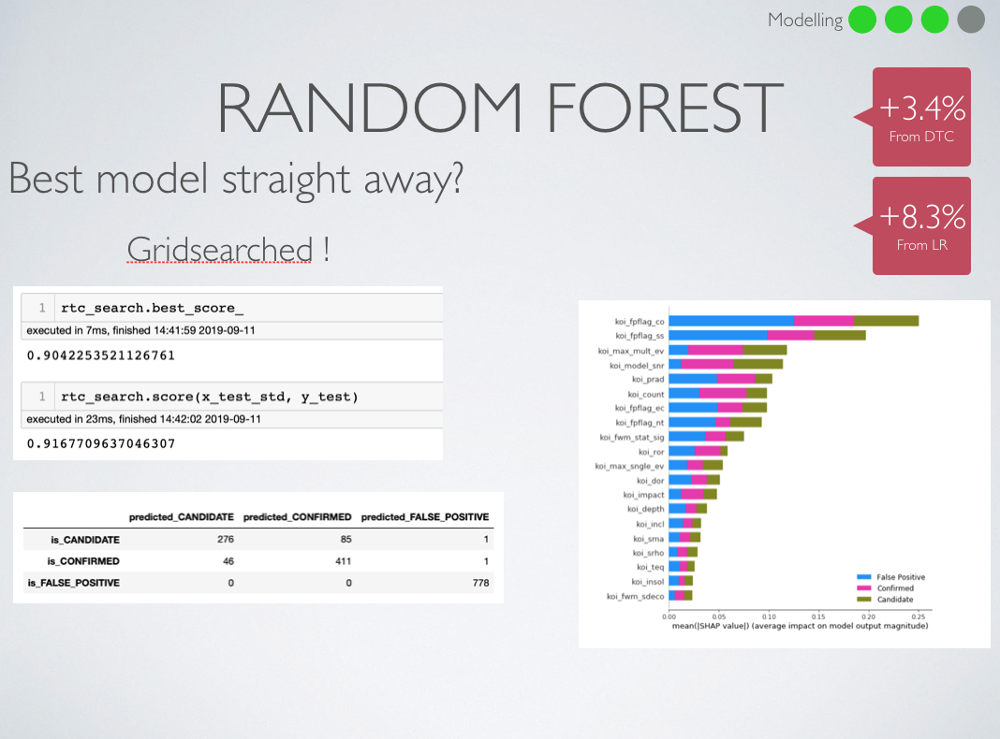

# Predicting NASA Kepler Objects of Interest 

I will utilise the data retrieved from the NASA API to predict whether a Kepler Object of Interest is a: 'False Positive',
'Candidate' or 'Positive'; in regards to containing a solar system or exoplanet. This will be extremely useful for scientists/astronomers
who may want to look further into specific kepler objects of interest and want to determine whether or it the object
would be worth investigating.


 What this means is that whether a light source observed by the Kepler Telescope is a star with an actual solar systems and should be investigated as to whether there is a planet which is potentially habitable.

## Packages

These are the main parent packages which are used.

```
import numpy as np
import pandas as pd
import statistics
import matplotlib.pyplot as plt
import seaborn as sns
import shap
import scikitplot as skplt
```
Additional Packages area as follows:

```
from matplotlib.colors import ListedColormap
cmap = ListedColormap(sns.color_palette("husl",3))

from sklearn.preprocessing import normalize, StandardScaler, MinMaxScaler 
from sklearn.linear_model import LogisticRegression, LinearRegression
from sklearn.tree import DecisionTreeClassifier, DecisionTreeRegressor,export_graphviz
from sklearn.ensemble import RandomForestClassifier, RandomForestRegressor, AdaBoostClassifier, AdaBoostRegressor, bagging, BaggingClassifier, BaggingRegressor 
from sklearn.svm import LinearSVC, SVC
from sklearn.model_selection import cross_val_score,GridSearchCV
from IPython.core.display import Image, display
from sklearn.metrics import confusion_matrix, accuracy_score, precision_score, recall_score, f1_score,roc_curve, auc, precision_recall_curve, average_precision_score, classification_report
from sklearn.model_selection import train_test_split
from sklearn.pipeline import Pipeline
from sklearn.decomposition import PCA
from sklearn.externals.six import StringIO
from subprocess import call
from sklearn.ensemble import AdaBoostClassifier, GradientBoostingClassifier


pd.set_option('display.max_columns', 150)
```

## Retrieving the data

First you will have to retrieve the data from the NASA API

```
url = "https://exoplanetarchive.ipac.caltech.edu/cgi-bin/nstedAPI/nph-nstedAPI?table=cumulative&select=*=dec" 

url_saved = pd.read_csv(url)
```

## Variables

I have a variety of metrics ranging from how many planets are present in the stars system, to whether the star’s light emittance is mimicking that of a star with planets in the system, to the phosphoric temperature of the star, and the radius of the star.

## EDA

I went through and described the data throughout the data set and found columns to drop and columns with Nans I had to fill.

Initially I wasn’t going to drop the error variables but after I ran a few initial models I decided to return and drop the variables with err in the title - after dropping these columns the models score improved minutely.

## Modelling

I found that the data reacted better to being fit by Tree models rather than a logistic regression, this led to a variety of gridsearches and running Random Forest Classifiers too. I found that the models struggled to some extent differentiating between Candidate and Positive targets - which is understandable - a false positive was believed to be a star with a planets in its solar system initially.

The difference between scores was small, Random Forest Classifier had an 8.4% increase from the Logistic Regression and a 3.4% increase from the Decision Tree Classifier



## Changing My Data

I decided to reformat the data again, I normalised and then standardised the data this time around. This proved to marginally increase the score. I ran AdaBoost and Gradient boost to see if either of the ensemble methods could improve the score.

Results and Reflections:


